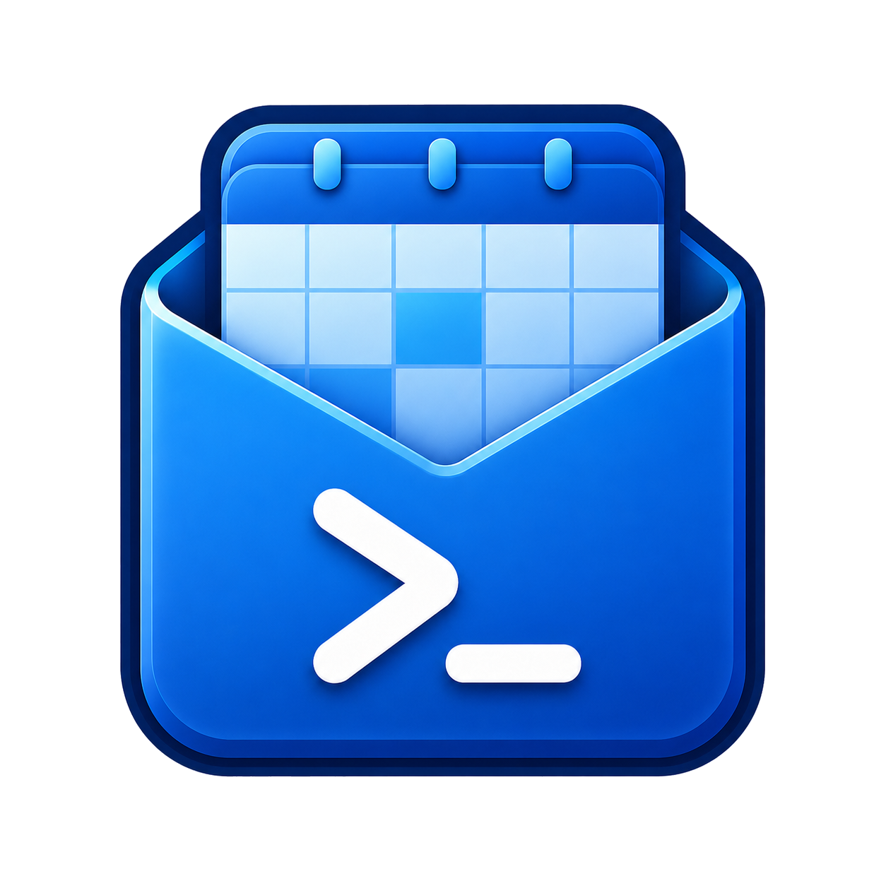

<div align="center">
  
  <h1>outlook-cli</h1>
  <p><em>An unofficial command-line tool for reading your Outlook Web calendar.</em></p>
</div>

---

`outlook` talks to Outlook's private OWA/Exchange APIs so you can list last,
current, and next week's events from the terminal. Output is JSON, so it pipes
cleanly into `jq`.

> [!WARNING]
> **Unofficial and unaffiliated.** This project is not associated with Microsoft.
> It calls private, undocumented APIs that can change without notice and may be
> subject to your organization's acceptable-use policies. Use it at your own risk.

## Install

```bash
cargo install --path . --locked
```

## Usage

```console
$ outlook --help
Query an Outlook Web calendar from the terminal

Usage: outlook <COMMAND>

Commands:
  auth         Authentication and token lifecycle
  config       Read or update local configuration
  calendar     Calendar queries
  completions  Generate shell completions
  help         Print this message or the help of the given subcommand(s)

Options:
  -h, --help     Print help
  -V, --version  Print version
```

Run `outlook <command> --help` for a group's subcommands.

## Setup

```bash
outlook config set username person@example.com
outlook config set password
outlook config set authenticator-key
outlook auth login
```

The password and authenticator-key commands prompt without echoing input. The
authenticator key may be a base32 secret or an `otpauth://` URI. Credential login
supports Authenticator TOTP and uses Chrome or Chromium, discovered from `PATH`
by default.

## Calendar

```bash
outlook calendar list --week current
outlook calendar list --week next | jq '.events[] | {start, subject, organizer}'
outlook calendar list --week last --raw
```

Weeks run Sunday through Saturday. The timezone defaults from the operating
system and can be overridden with:

```bash
outlook config set timezone 'Eastern Standard Time'
```

## Notes

- Authentication automatically tries the cached access token, refresh token,
  persistent Microsoft session, and finally headless username/password/TOTP login.
- `outlook auth logout` clears only the CLI's authentication state; configured
  credentials are preserved.
- Configuration, tokens, cookies, and credentials are stored in plaintext at
  `~/.config/outlook-cli/session.json`. The directory and file use owner-only
  permissions, and the file is replaced atomically.
- `outlook config get` redacts secrets unless `--show-secrets` is supplied.

## License

[MIT](LICENSE)
